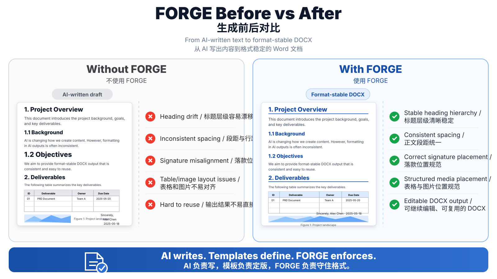
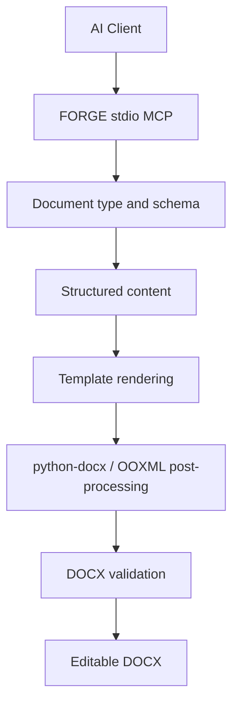

# FORGE

**Format-Oriented Rendering & Generation Engine**  
**面向 AI Agent 的模板驱动 Word DOCX 生成与格式约束引擎**

[](VERSION)
[](requirements.txt)
[](README.md)
[](templates)
[](LICENSE)
[](https://github.com/IIIIQAQIIII/FORGE-docx/actions/workflows/ci.yml)
[](https://github.com/IIIIQAQIIII/FORGE-docx/releases/latest)

> **Forge documents that don’t break.**  
> **锻造不会崩坏的文档。**
>
> **AI writes. FORGE holds the format.**  
> **AI 负责写内容，FORGE 负责守住格式。**

Version / 当前版本：**v1.1**

FORGE is a local stdio MCP engine for generating editable Word DOCX files from structured content and reusable templates.

FORGE 是一个本地运行的 stdio MCP 文档引擎。它不让 AI 自由“画”Word 格式，而是让 AI 负责理解需求和生成内容，让模板负责定义版式，再由 FORGE 完成**文档类型选择、字段约束、模板渲染、OOXML 后处理、校验与轻量修复**，最终生成可继续编辑的 `.docx` 文件。

一句话概括：**AI 负责写，模板负责定版，FORGE 负责把内容稳定地放进正确格式。**

## Formatting references / 格式依据

FORGE 的格式体系来自两类来源：

1. **规范性公文版式参考**：传统公文模板参考现行推荐性国家标准 [GB/T 9704-2012《党政机关公文格式》](https://openstd.samr.gov.cn/bzgk/std/newGbInfo?hcno=F3CC9BEF482524C895FDA7A08BB4A70E) 的核心排版原则，并结合 Word 模板自动化生成的实际需要进行工程化实现。
2. **业务文档模板经验**：论文、周报、活动资料、培训资料等模板来自常见行政、教育与办公场景中的可复用 Word 行文规则，并进一步固化为可由 AI 填充的结构化模板。

> **说明：** GB/T 9704-2012 的参考主要针对“传统公文”这一文档族。论文、周报、活动资料、培训资料属于 FORGE 的业务模板规范，不应理解为全部属于国家标准公文格式。FORGE 也不替代最终的人工审校或具体单位内部行文制度。

### Current formatting rules / 当前内置格式要求

| 文档族 | 当前主要版式规则 |
|---|---|
| **传统公文** | 标题采用 2 号方正小标宋、居中、固定 32 磅；正文采用 3 号仿宋、固定 28 磅；支持“一、→（一）→1.”三级层次，分别使用黑体 / 楷体 / 仿宋；页码为 4 号宋体阿拉伯数字并带一字线；普通公文不使用红色红头和双红线。 |
| **活动方案** | 沿用传统公文正文体系，增加“单位 + 部门 + 日期”三行落款，三行共享中线并整体靠右。 |
| **论文 / 长文** | 无页眉；标题和各级标题默认不加粗；正文小四宋体、固定 18 磅；支持摘要、关键词、三线表和图片；演讲稿 / 发言稿可省略摘要和关键词。 |
| **行政周报** | 两行标题；按部门分节；每段自动编号；没有内容时可输出“无”。 |
| **培训通知** | 使用通知类专用格式，包含红色红头与双红线。 |
| **培训活动记录** | 使用结构化活动记录表格。 |
| **活动 / 培训影像** | 使用标题 + 信息表 + 图片页结构，可将两张照片排在同一页。 |

FORGE 的关键设计原则是：**模板才是格式的唯一事实来源（source of truth）**。字体、字号、行距、页边距、标题层级、落款位置、表格、图片区域、页码等尽量由模板和固定规则控制，而不是交给大模型临时决定。

## Supported documents / 支持的文档类型

当前公开版内置 **11 个已脱敏 Word 模板**，并通过多个友好文档类型进行调用。

| 文档类型 / 用户可以这样说 | 实际模板 / 用途 |
|---|---|
| `传统公文`、`计划`、`总结`、`方案`、`汇报`、`报告`、`请示` | 通用传统公文模板 |
| `活动方案` | 带部门三行落款的活动方案模板 |
| `论文`、`演讲稿`、`发言稿`、`长文` | 论文 / 长文模板 |
| `行政周报`、`周报` | 行政周报模板 |
| `活动总结` | 活动总结模板 |
| `活动影像` | 活动影像资料模板 |
| `培训通知` | 红头 + 双红线培训通知 |
| `培训活动记录` | 培训活动记录表 |
| `培训活动影像` | 培训影像资料 |
| `培训通知记录`、`通知培训资料` | 通知 + 活动记录 + 活动影像三合一版本 |
| `sample` | MCP 与模板渲染测试用最小模板 |

### Document sets / 成套资料

FORGE 还可以一次生成一组相互配套的文档：

- **活动方案套装**：活动方案 → 活动总结 → 活动影像
- **培训资料套装**：培训通知 → 培训活动记录 → 培训活动影像

### File scope / 文件范围

当前 FORGE 的核心目标文件是 **Microsoft Word `.docx`**：

- 模板：`.docx`
- AI / MCP 输入：结构化字段（JSON / MCP 参数）
- 输出：可继续编辑的 `.docx`
- 可在 DOCX 中插入图片、三线表等内容

当前版本**不直接生成 PDF、XLSX 或 PPTX**。FORGE 的定位不是通用 Office 转换器，而是专注于**高稳定性的模板化 Word 文档生成**。

## What can this MCP do? / 这个 MCP 能干什么

把 FORGE 接入 Codex、DeepSeek Harness / DSH 或其他 stdio MCP 客户端后，AI 不只是“帮你写一段文字”，而是可以完成一条完整的 Word 文档工作流：

1. **识别应该用什么文档格式**：根据“写计划 / 写总结 / 写论文 / 写周报 / 做培训资料”等意图选择合适模板。
2. **读取模板需要哪些字段**：自动获取标题、正文、章节、落款、日期、图片等字段要求和示例数据。
3. **让 AI 先生成结构化内容**：把自然语言需求整理为模板可接受的结构化数据，而不是把整篇文字直接硬塞进 Word。
4. **生成 DOCX**：按模板渲染内容，并通过 `python-docx / OOXML` 做必要的后处理。
5. **批量生成成套资料**：一次生成活动方案 + 总结 + 影像，或培训通知 + 记录 + 影像。
6. **插入图片和三线表**：在支持的模板中将图片、表格内容放到预设版式位置。
7. **校验生成结果**：检查 DOCX 的基础内容、布局以及是否遗留未替换的模板占位符。
8. **安全地做轻量修复**：处理 NBSP、意外尾随空格等可保守修复的问题，不进行激进的“重排整个文档”。
9. **处理学期辅助规则**：提供学年度 / 学期时间辅助信息，帮助涉及学期材料的 AI 生成更合理的日期和周期。

它适合这样的交互：

```text
用户：帮我写一份本学期教研工作总结，按正式公文格式出 Word。

AI
  ↓ 判断文种
传统公文 / 总结
  ↓ 读取模板字段
get_template_schema
  ↓ 生成结构化内容
标题、开头、一级/二级/三级内容、落款、日期
  ↓
FORGE generate_by_type
  ↓
validate_docx
  ↓
可编辑、格式稳定的 DOCX
```

## Before vs After / 生成前后对比

FORGE 的价值不只是“生成一篇文档”，而是把 AI 生成的内容**稳定地锻造成格式可控、可继续编辑的 Word 文档**。

通用大模型通常很擅长内容生成，但在 Word 文档中，标题层级、段距、落款、页码、表格、图片和模板结构容易出现格式漂移。FORGE 通过模板和固定规则把这些格式责任从大模型手中拿回来。

<p align="center">
  
</p>

### Without FORGE / 不使用 FORGE

- 标题层级容易漂移
- 段距与行距不一致
- 落款位置可能偏移
- 表格与图片不易稳定对齐
- 输出结果往往还需要大量人工整理

### With FORGE / 使用 FORGE

- 标题层级由模板和规则控制
- 正文段距、行距和版式保持一致
- 落款、表格、图片进入预设位置
- 生成结果可直接继续编辑
- 同一模板可以稳定复用到下一份文档

**AI writes. Templates define. FORGE enforces.**  
**AI 负责写，模板负责定版，FORGE 负责守住格式。**

## MCP tools / MCP 工具

| Tool | Purpose / 用途 |
|---|---|
| `list_document_types` | 查看当前可用文档类型、模板、格式指南和文档套装 |
| `get_template_schema` | 查看指定模板所需字段、说明和示例数据 |
| `get_semester_info` | 获取学年度 / 学期辅助信息 |
| `recommend_document_type` | 根据用户需求推荐合适文档类型 |
| `generate_docx` | 按指定模板直接生成 DOCX |
| `generate_by_type` | 按友好文档类型生成 DOCX |
| `generate_document_set` | 一次生成成套文档 |
| `validate_docx` | 检查内容、基础版式和残留占位符 |
| `fix_docx` | 执行保守的 DOCX 轻量修复 |

## Why FORGE / 为什么选择 FORGE

AI 很擅长写内容，但复杂 Word 文档最容易在**标题、字体、字号、段距、页边距、页码、表格、图片、落款和层级结构**上发生格式漂移。

FORGE 不重新发明 Word，也不鼓励 AI 临时猜格式，而是把模板作为格式的唯一事实来源：

```text
AI content / AI 内容
        ↓
Structured payload / 结构化数据
        ↓
FORGE
        ↓
Template rendering + OOXML post-processing
模板渲染 + OOXML 后处理
        ↓
Validation / 文档校验
        ↓
Editable DOCX / 可编辑 DOCX
```

## Client support / 客户端支持

- Codex
- DeepSeek Harness / DSH
- Other stdio MCP clients / 其他支持 stdio MCP 的 AI 客户端



## Install / 安装

Clone the repository / 克隆仓库：

```bash
git clone https://github.com/IIIIQAQIIII/FORGE-docx.git
cd FORGE-docx
```

### macOS / Linux

```bash
bash install_mcp.sh
```

### Windows PowerShell

```powershell
powershell -ExecutionPolicy Bypass -File .\install_mcp.ps1
```

The installer creates an isolated virtual environment, installs dependencies, verifies the FORGE server and templates, and prints or registers the stdio MCP configuration for supported clients.

安装器会自动创建独立虚拟环境、安装依赖、检查 FORGE MCP Server 与模板，并为支持的客户端自动注册或输出 stdio MCP 配置。

See `INSTALL.md` for detailed installation instructions.  
详细安装方式见 `INSTALL.md`。

## Typical flow / 典型流程

```text
User request / 用户需求
  -> list_document_types
  -> get_template_schema
  -> structured JSON / 结构化内容
  -> generate_by_type
  -> validate_docx
  -> DOCX
```

Generated files default to `outputs/` when only a file name is provided.  
仅指定文件名时，生成结果默认保存到 `outputs/`。

## Public snapshot policy / 公开版本与脱敏策略

This repository is a sanitized public snapshot generated from a separate private development source. The public build does not inherit private Git history.

本仓库是由独立 Private 开发源生成的**脱敏公开快照**，公开仓库不会继承 Private 仓库的 Git 历史。

Before a public snapshot is produced, the build checks text files and DOCX package XML for blocked terms and high-risk personal-data patterns. It also clears document author metadata, strips Word preview thumbnails, replaces private embedded template images with blank placeholders, and rejects comments, tracked changes, embedded objects, or external relationships.

公开构建会扫描文本和 DOCX 内部 XML 中的敏感词与高风险个人信息模式，并清除作者元数据、Word 预览缩略图和私有模板图片；同时拒绝批注、修订记录、嵌入对象和外部关系等可能造成信息泄露的结构。

> 本公开版本中的单位名称、人员名称和示例内容均为虚构或脱敏信息，不代表任何真实机构或个人。

Private and public releases may share the same version number while using different commit SHAs.

Private 与 Public 可以使用相同版本号，但 Git Commit SHA 独立。

## License / 开源许可

FORGE is released under the **MIT License**. See `LICENSE` for the full license text.

FORGE 使用 **MIT License** 开源，完整许可文本见 `LICENSE`。