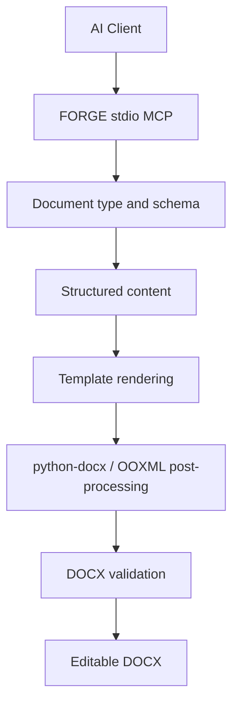

# FORGE

**Format-Oriented Rendering & Generation Engine**

[](VERSION)
[](requirements.txt)
[](README.md)
[](templates)
[](LICENSE)
[](https://github.com/IIIIQAQIIII/FORGE-docx/actions/workflows/ci.yml)
[](https://github.com/IIIIQAQIIII/FORGE-docx/releases/latest)

> **Forge documents that don’t break.**
>
> **AI writes. FORGE holds the format.**

Version: **v1.1**

FORGE is a local stdio MCP engine for generating editable Word DOCX files from structured content and reusable templates.

核心思路：**AI 负责理解需求和生成结构化内容，FORGE 负责把内容稳定地锻造成符合模板约束的 Word 文档。**

## Why FORGE

AI 很擅长写内容，但复杂 Word 文档最容易在标题、段距、页边距、页码、表格、图片和模板结构上发生格式漂移。

FORGE 的目标不是重新发明 Word，而是让模板成为格式的唯一事实来源：

```text
AI content
   ↓
Structured payload
   ↓
FORGE
   ↓
Template rendering + OOXML post-processing
   ↓
Validation
   ↓
Editable DOCX
```

## Client support

- Codex
- DeepSeek Harness / DSH
- Other stdio MCP clients



## Features

- 传统公文、计划、总结、方案、汇报、报告、请示
- 活动方案、活动总结、活动影像
- 论文、演讲稿、发言稿等长文
- 行政周报
- 培训通知、培训活动记录、培训活动影像
- 批量生成成套文档
- 图片与三线表插入
- DOCX 基础校验与轻量修复

> 本公开版本中的单位名称、人员名称和示例内容均为虚构或脱敏信息，不代表任何真实机构或个人。

## Install

```bash
git clone https://github.com/IIIIQAQIIII/forge-docx.git
cd forge-docx
```

macOS / Linux:

```bash
bash install_mcp.sh
```

Windows PowerShell:

```powershell
powershell -ExecutionPolicy Bypass -File .\install_mcp.ps1
```

The installer creates an isolated virtual environment, installs dependencies, and prints or registers the stdio MCP configuration for supported clients.

See `INSTALL.md` for details.

## MCP tools

| Tool | Purpose |
|---|---|
| `list_document_types` | List document types, templates and rules |
| `get_template_schema` | Show expected fields and example payload |
| `get_semester_info` | Return semester helper information |
| `recommend_document_type` | Provide a deterministic fallback recommendation |
| `generate_docx` | Render a named template |
| `generate_by_type` | Generate by friendly document type |
| `generate_document_set` | Generate a document bundle |
| `validate_docx` | Run basic DOCX checks |
| `fix_docx` | Apply conservative light repairs |

## Typical flow

```text
User request
  -> list_document_types
  -> get_template_schema
  -> structured JSON
  -> generate_by_type
  -> validate_docx
  -> DOCX
```

Generated files default to `outputs/` when only a file name is provided.

## Public snapshot policy

This repository is a sanitized public snapshot generated from a separate private development source. The public build does not inherit private Git history.

Before a public snapshot is produced, the build checks text files and DOCX package XML for blocked terms and high-risk personal-data patterns. It also clears document author metadata, strips Word preview thumbnails, replaces private embedded template images with blank placeholders, and rejects comments, tracked changes, embedded objects, or external relationships.

Private and public releases may share the same version number while using different commit SHAs.

## License

FORGE is released under the **MIT License**. See `LICENSE` for the full license text.
