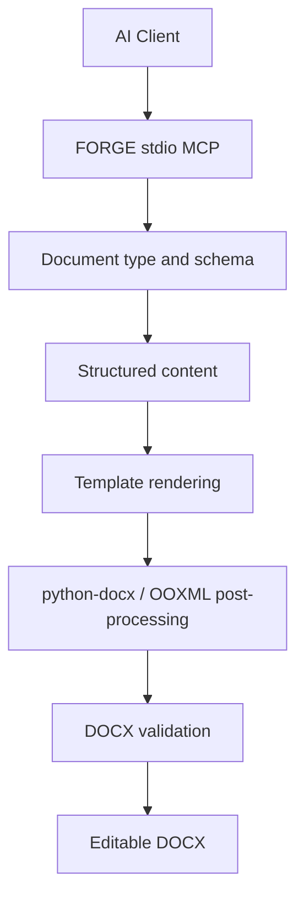

# FORGE

**Format-Oriented Rendering & Generation Engine**  
**面向 AI Agent 的模板驱动 Word DOCX 生成与格式约束引擎**

[](VERSION)
[](requirements.txt)
[](README.md)
[](templates)
[](LICENSE)
[](https://github.com/IIIIQAQIIII/FORGE-docx/actions/workflows/ci.yml)
[](https://github.com/IIIIQAQIIII/FORGE-docx/releases/latest)

> **Forge documents that don’t break.**  
> **锻造不会崩坏的文档。**
>
> **AI writes. FORGE holds the format.**  
> **AI 负责写内容，FORGE 负责守住格式。**

Version / 当前版本：**v1.1**

FORGE is a local stdio MCP engine for generating editable Word DOCX files from structured content and reusable templates.

FORGE 是一个本地运行的 stdio MCP 文档引擎，用于将 AI 生成的结构化内容稳定地写入可复用 Word 模板，生成可继续编辑的 DOCX 文档。

核心思路：**AI 负责理解需求和生成内容，模板负责定义版式，FORGE 负责渲染、约束、校验与轻量修复。**

## Why FORGE / 为什么选择 FORGE

AI is excellent at writing content, but complex Word documents often drift in headings, paragraph spacing, page margins, page numbers, tables, images, and template structure.

AI 很擅长写内容，但复杂 Word 文档最容易在标题、段距、页边距、页码、表格、图片、落款和模板结构上发生“格式漂移”。

FORGE does not try to reinvent Word. It treats the template as the source of truth for formatting and lets AI focus on content.

FORGE 不重新发明 Word，而是把**模板作为格式的唯一事实来源**：AI 专注内容，FORGE 负责把内容稳定锻造成符合模板要求的文档。

```text
AI content / AI 内容
        ↓
Structured payload / 结构化数据
        ↓
FORGE
        ↓
Template rendering + OOXML post-processing
模板渲染 + OOXML 后处理
        ↓
Validation / 文档校验
        ↓
Editable DOCX / 可编辑 DOCX
```

## Client support / 客户端支持

- Codex
- DeepSeek Harness / DSH
- Other stdio MCP clients / 其他支持 stdio MCP 的 AI 客户端



## Features / 功能特性

- 传统公文、计划、总结、方案、汇报、报告、请示
- 活动方案、活动总结、活动影像
- 论文、演讲稿、发言稿等长文
- 行政周报
- 培训通知、培训活动记录、培训活动影像
- 批量生成成套文档
- 图片与三线表插入
- DOCX 基础校验与轻量修复
- Template-driven generation / 模板驱动生成
- Local stdio MCP / 本地 stdio MCP，不依赖云端文档服务

> 本公开版本中的单位名称、人员名称和示例内容均为虚构或脱敏信息，不代表任何真实机构或个人。

## Install / 安装

Clone the repository / 克隆仓库：

```bash
git clone https://github.com/IIIIQAQIIII/FORGE-docx.git
cd FORGE-docx
```

### macOS / Linux

```bash
bash install_mcp.sh
```

### Windows PowerShell

```powershell
powershell -ExecutionPolicy Bypass -File .\install_mcp.ps1
```

The installer creates an isolated virtual environment, installs dependencies, verifies the FORGE server and templates, and prints or registers the stdio MCP configuration for supported clients.

安装器会自动创建独立虚拟环境、安装依赖、检查 FORGE MCP Server 与模板，并为支持的客户端自动注册或输出 stdio MCP 配置。

See `INSTALL.md` for detailed installation instructions.  
详细安装方式见 `INSTALL.md`。

## MCP tools / MCP 工具

| Tool | Purpose / 用途 |
|---|---|
| `list_document_types` | List document types, templates and rules / 查看文档类型、模板与规则 |
| `get_template_schema` | Show expected fields and example payload / 查看模板字段与示例数据 |
| `get_semester_info` | Return semester helper information / 获取学期辅助信息 |
| `recommend_document_type` | Provide a deterministic fallback recommendation / 推荐合适文档类型 |
| `generate_docx` | Render a named template / 按指定模板生成 DOCX |
| `generate_by_type` | Generate by friendly document type / 按文档类型生成 |
| `generate_document_set` | Generate a document bundle / 批量生成成套资料 |
| `validate_docx` | Run basic DOCX checks / 校验 DOCX |
| `fix_docx` | Apply conservative light repairs / 进行安全的轻量修复 |

## Typical flow / 典型流程

```text
User request / 用户需求
  -> list_document_types
  -> get_template_schema
  -> structured JSON / 结构化内容
  -> generate_by_type
  -> validate_docx
  -> DOCX
```

Generated files default to `outputs/` when only a file name is provided.  
仅指定文件名时，生成结果默认保存到 `outputs/`。

## Public snapshot policy / 公开版本与脱敏策略

This repository is a sanitized public snapshot generated from a separate private development source. The public build does not inherit private Git history.

本仓库是由独立 Private 开发源生成的**脱敏公开快照**，公开仓库不会继承 Private 仓库的 Git 历史。

Before a public snapshot is produced, the build checks text files and DOCX package XML for blocked terms and high-risk personal-data patterns. It also clears document author metadata, strips Word preview thumbnails, replaces private embedded template images with blank placeholders, and rejects comments, tracked changes, embedded objects, or external relationships.

公开构建会扫描文本和 DOCX 内部 XML 中的敏感词与高风险个人信息模式，并清除作者元数据、Word 预览缩略图和私有模板图片；同时拒绝批注、修订记录、嵌入对象和外部关系等可能造成信息泄露的结构。

Private and public releases may share the same version number while using different commit SHAs.

Private 与 Public 可以使用相同版本号，但 Git Commit SHA 独立。

## License / 开源许可

FORGE is released under the **MIT License**. See `LICENSE` for the full license text.

FORGE 使用 **MIT License** 开源，完整许可文本见 `LICENSE`。